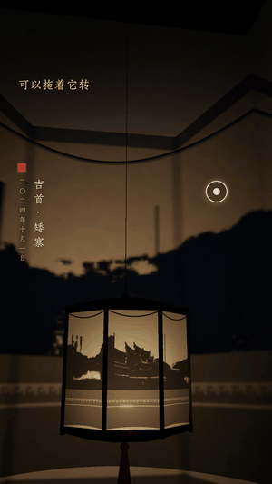
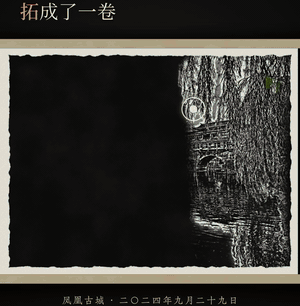
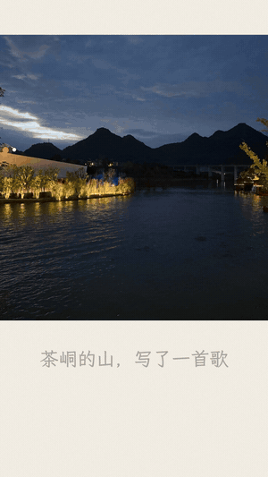

# trip-photo-skills

把旅行照片做成能玩、能听的中国物件。「我有一座园」系列，每期一件。

中文 · [English](README.en.md)

 

| 01 · 走马灯 | 02 · 拓片长卷 | 03 · 一张画 · 一首歌 · 一封信 |
|---|---|---|
|  |  |  |
| 照片的天际线剪成剪纸贴进灯筒，烛光把影子投满四面墙；点一下影子，它变回原来那张照片。 | 整卷是墨黑的拓片纸，手指擦过的地方照片像碑拓一样显出来，墨色再晕回彩色，擦完一段盖一方印。 | 照片里的山脊有多高，音就有多高，读成一首小乐队编曲的歌；手绘小人回到照片里；这个地方再用你真实的拍摄时间给你写一封信。 |

01、02 都不是滤镜，也不是 AI 生图：

- **不花生图额度**：照片在本机处理，画面是代码实时算出来的。
- **照片在你自己电脑上处理**：网页里不写 GPS、机型、原文件名。
- **一个文件**：输出单文件 HTML，双击就能打开，手机浏览器也能玩。

03 的歌、信和出片都在本机完成；「画」是可选步骤，要用你自己的生图额度，不想生图就直接用原照片出片。

## 安装

```bash
npx skills add dososo/trip-photo-skills --skill trip-photo-lantern
npx skills add dososo/trip-photo-skills --skill trip-photo-rubbing-scroll
npx skills add dososo/trip-photo-skills --skill trip-photo-song-letter
```

装好后对 AI 说：「用 trip-photo-lantern，把 ~/Pictures/2024国庆 做成走马灯。」「用 trip-photo-rubbing-scroll，把这 6 张照片拓成一卷。」或者「用 trip-photo-song-letter，把 ~/Pictures/凤凰 做成一集一张画、一首歌、一封信。」

也可以手动安装：把 `skills/` 下对应的文件夹整个复制到

- Claude Code：`~/.claude/skills/<名字>/`
- Codex：`~/.codex/skills/<名字>/`

## 01 · 走马灯 `trip-photo-lantern`

- **输入**一个旅行照片文件夹，自动挑出天际线清楚的 8 张；**输出** `lantern.html`（约 1.5 MB）。
- 依赖：Python 3.10+，`python3 -m pip install pillow numpy torch transformers`。抠天空用的分割模型 `openmmlab/upernet-convnext-tiny`（MIT）第一次运行时下载，约 240 MB。
- 不用 AI 助手也能直接跑：

  ```bash
  cd skills/trip-photo-lantern
  python3 scripts/lantern.py all --photos ~/Pictures/2024国庆 --out ~/Desktop/lantern
  ```

- 示例：[`examples/xiangxi-2024/lantern.html`](skills/trip-photo-lantern/examples/xiangxi-2024/lantern.html)。拖动转灯；点墙上的影子看原照片，再点一下收回；空格揭开背墙正中那一格。
- 原理：挑片按天空占比、天际线起伏与锯齿、天空亮度打分，再按时间、地点、画面相似度去重；光照不用阴影贴图，逐条光线解析计算「烛焰 → 内筒剪纸 → 八角灯罩 → 墙面」。细节见 [pipeline.md](skills/trip-photo-lantern/references/pipeline.md)。

## 02 · 拓片长卷 `trip-photo-rubbing-scroll`

- **输入**一个放了 2–8 张照片的文件夹；**输出** `scroll.html`（6 段约 6 MB）。
- 依赖：只要 `pillow` 和 `numpy`，不下载模型，不需要 GPU。

  ```bash
  cd skills/trip-photo-rubbing-scroll
  python3 scripts/scroll.py all --photos ~/Pictures/挑好的6张 --out ~/Desktop/scroll
  ```

- 示例：[`examples/xiangxi-2024/scroll.html`](skills/trip-photo-rubbing-scroll/examples/xiangxi-2024/scroll.html)。一根手指擦；两根手指左右拖、滚轮或两侧箭头翻卷；右上角「重拓」重来。
- 原理：拓片上石面上墨是黑的，刻线碰不到墨留白——照片的细节高通（瓦楞、窗格、山脊）就是刻线，天空和水面是石面；擦拭蒙版按「1 −（1 − 已有）×（1 − 本次）」叠加，擦透后按噪声决定的先后晕回彩色。细节见 [pipeline.md](skills/trip-photo-rubbing-scroll/references/pipeline.md)。

## 03 · 一张画 · 一首歌 · 一封信 `trip-photo-song-letter`

- **输入**同一个地方的旅行照片（一个文件夹）；**输出** `episode.mp4`（1080×1920，约 50 秒）和这首歌 `song.wav`。
  - 一首歌：沿照片里的山脊或屋檐读出旋律，前奏、主歌、副歌（倒着读）、间奏、高潮（读最高的那一段）、尾声；八音盒、钢琴、弦乐、竖琴、长笛、木吉他、贝斯、轻鼓的小乐队编曲。同一张照片每次写出来的歌都一样。
  - 一张画（可选）：一个手绘小人回到照片里，做一件和这个地方有关的小事。要用你自己的生图额度，照片会上传给生图服务，skill 会先问你。
  - 一封信：这个地方给你写一封短信，只用照片里读得到的事实（拍摄时间、张数）。
- 依赖：Python 3.10+，`python3 -m pip install numpy scipy pillow opencv-python soundfile torch transformers`，以及 ffmpeg。分割模型同 01；乐器采样 VSCO 2 Community Edition（CC0，约 236 MB）和字体霞鹜文楷（OFL，约 51 MB）用 `fetch` 下载到本机缓存，不在仓库里。
- 只要歌，不用 AI 助手也能直接跑：

  ```bash
  cd skills/trip-photo-song-letter
  python3 scripts/episode.py fetch --yes
  python3 scripts/episode.py ridge --photo ~/Pictures/山.jpg --out ~/Desktop/song
  python3 scripts/episode.py song --from 0.1 --to 0.9 --out ~/Desktop/song
  ```

- 示例：[`examples/xiangxi-2024/episode.mp4`](skills/trip-photo-song-letter/examples/xiangxi-2024/episode.mp4)（边城茶峒，2024 年 10 月），信和字幕在同目录的 `episode.json`。
- 原理：分割模型找到天空，再沿亮度梯度用动态规划逐列找真实的山脊边缘；旋律只由山脊起伏和固定的乐理规则决定（强拍取和弦音、偏爱级进、乐句落在规定的音上）。细节见 [pipeline.md](skills/trip-photo-song-letter/references/pipeline.md)。

## 常见问题

**没有生图能用吗？** 能。01、02 都不需要生图；03 的「画」是可选步骤，不生图就直接用原照片出片。

**有人的照片会被用上吗？** 走马灯默认跳过人物面积超过 0.2% 的照片；拓片长卷不做人像检测；一张画一首歌一封信在做工作副本时提醒人物面积超过 0.2% 的照片。远处很小的人影都可能留在画面里，分享前自己看一眼。

**让 AI 助手看图安全吗？** 处理脚本不上传照片；但如果你让 AI 助手打开图片，图片会作为对话内容发给对应的模型服务商。skill 默认只给你路径，由你自己打开。

**手机上能做吗？** 生成需要电脑（Python）；生成的网页和视频手机都能打开。

## 许可

- 代码：[Apache-2.0](LICENSE)
- 示例照片及其衍生图：© dososo，不在代码许可范围内，见 [ASSET-LICENSE.md](ASSET-LICENSE.md)
- 第三方组件：见 [NOTICE](NOTICE)

## 作者

**爆裂队长 NEXT（BLCaptain）**

- GitHub：[dososo](https://github.com/dososo)
- X：[@thinkszyg](https://x.com/thinkszyg)
- 邮箱：[blteam2026@outlook.com](mailto:blteam2026@outlook.com)
